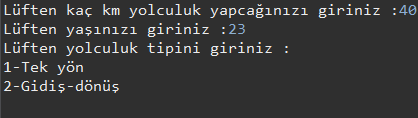
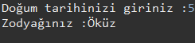
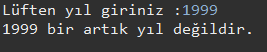
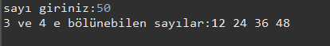
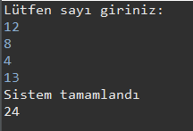

# Java 101 Homeworks

## [Not Ortalama Hesaplama Programı](https://github.com/Berbet16/java101_practice_homeworks/blob/main/not_ortalama_hesaplay%C4%B1c%C4%B1.java)

- Java ile Matematik, Fizik, Kimya, Türkçe, Tarih, Müzik derslerinin sınav puanlarını kullanıcıdan alan ve ortalamalarını hesaplayıp ekrana bastırılan programı yazın.

- Aynı program içerisinde koşullu ifadeler kullanılarak, eğer kullanıcının ortalaması 60'dan büyük ise ekrana "Sınıfı Geçti" , küçük ise "Sınıfta Kaldı" yazsın.

**(Not : If ve Else kullanılmayacak...)** 

---

## [KDV Tutarı Hesaplayan Program](https://github.com/Berbet16/java101_practice_homeworks/blob/main/KDV_Tutar%C4%B1_Hesaplayan_Program.java)
- Java ile kullanıcıdan alınan para değerinin KDV'li fiyatını ve KDV tutarını hesaplayıp ekrana bastıran programı yazın.

**(Not : KDV tutarını 18% olarak alın)**

KDV'siz Fiyat = 10;

KDV'li Fiyat = 11.8;

KDV tutarı = 1.8;

Eğer girilen tutar 0 ve 1000 TL arasında ise KDV oranı %18 , tutar 1000 TL'den büyük ise KDV oranını %8 olarak KDV tutarı hesaplayan programı yazınız.

---

## [Dik Üçgende Hipotenüs Bulan Program](https://github.com/Berbet16/java101_practice_homeworks/blob/main/Dik_U%C3%A7gende_Hipoten%C3%BCs_Bulan_Program.java)

- Java ile kullanıcıdan dik kenarlarının uzunluğunu alan ve hipotenüsü hesaplayan programı yazın.

- Üç kenar uzunluğunu kullanıcıdan aldığınız üçgenin alanını hesaplayan programı yazınız.

Formül
Üç𝑔𝑒𝑛𝑖𝑛 ç𝑒𝑣𝑟𝑒𝑠𝑖 = 2𝑢

𝑢 = (a+b+c) / 2

Alan * Alan = 𝑢 * (𝑢 − 𝑎)* (𝑢 − 𝑏) * (𝑢 − 𝑐)

---

## [Taksimetre Hesaplayan Program](https://github.com/Berbet16/java101_practice_homeworks/blob/main/Taksimetre_Hesaplayan_Program.java)

- Java ile gidilen mesafeye (KM) göre taksimetre tutarını ekrana yazdıran programı yazın.

---

## [Dairenin Alanını ve Çevresini Bulan Program](https://github.com/Berbet16/java101_practice_homeworks/blob/main/Dairenin_Alan%C4%B1n%C4%B1_ve_%C3%87evresini_Bulan_Program.java)

- Java ile yarı çapını kullanıcıdan aldığınız dairenin alanını ve çevresini hesaplayan programı yazın.

Alan Formülü : π * r * r;

Çevre Formülü : 2 * π * r;

- Yarıçapı r, merkez açısısının ölçüsü 𝛼 olan daire diliminin alanı bulan programı yazınız.

𝜋 sayısını = 3.14 alınız.

Formül : (𝜋 * (r*r) * 𝛼) / 360

---

## [Vücut Kitle İndeksi Hesaplayan Program](https://github.com/Berbet16/java101_practice_homeworks/blob/main/V%C3%BCcut_Kitle_Indeksi_Hesaplayan_Program.java)

- Java ile kullanıcıdan boy ve kilo değerlerini alıp bir değişkene atayın. Aşağıda ki formüle göre kullanıcının "Vücut Kitle İndeks" değerini hesaplayıp ekrana yazdırın.

Formül
Kilo (kg) / Boy(m) * Boy(m)

---

## [Manav Kasa Programı](https://github.com/Berbet16/java101_practice_homeworks/blob/main/Manav_Kasa.java)

- Java ile kullanıcıların manavdan almış oldukları ürünlerin kilogram değerlerine göre toplam tutarını ekrana yazdıran programı yazın.

- Meyveler ve KG Fiyatları

Armut : 2,14 TL  
Elma : 3,67 TL  
Domates : 1,11 TL  
Muz: 0,95 TL  
Patlıcan : 5,00 TL

---

## [Pratik Hesap Makinesi](https://github.com/Berbet16/java101_practice_homeworks/blob/main/Pratik_Hesap_Makinesi_Dersi.java)

- Java koşullu ifadeler ile basit hesap makinesi yapımı.

- Videodaki hesap makinesini switch-case kullanarak yapınız.

 
 ---
 
 ## [Kullanıcı Girişi Dersi](https://github.com/Berbet16/java101_practice_homeworks/blob/main/Pratik_Kullan%C4%B1c%C4%B1_Giri%C5%9Fi.java)
 
- Java koşullu ifadeler ile kullanıcı adı ve şifreyi kontrol eden program yapımı.

- Eğer şifre yanlış ise kullanıcıya şifresini sıfırlayıp sıfırlamayacağını sorun, eğer kullanıcı sıfırlamak isterse yeni girdiği şifrenin hatalı girdiği ve unuttuğu şifre ile aynı olmaması gerektiğini kontrol edip , şifreler aynı ise ekrana "Şifre oluşturulamadı, lütfen başka şifre giriniz." sorun yoksa "Şifre oluşturuldu" yazan programı yazınız.

---

## [Hava Sıcaklığına Göre Etkinlik Önerme](https://github.com/Berbet16/java101_practice_homeworks/blob/main/Hava_S%C4%B1cakl%C4%B1%C4%9Fna_G%C3%B6re_Etkinlik_Onerme.java)

- Java koşullu ifadeler ile hava sıcaklığına göre etkinlik öneren program yapımı.

Koşullar :

- Sıcaklık 5'dan küçük ise "Kayak" yapmayı öner.
- Sıcaklık 5 ve 15 arasında ise "Sinema" etkinliğini öner.
- Sıcaklık 15 ve 25 arasında ise "Piknik" etkinliğini öner.
- Sıcaklık 25'ten büyük ise "Yüzme" etkinliğini öner.

---

## [Sayıları Büyükten Küçüğe Sıralayan Program](https://github.com/Berbet16/java101_practice_homeworks/blob/main/Say%C4%B1lar%C4%B1_Buyukten_Kucuge_S%C4%B1ralama.java)

- Java koşullu ifadeler ile girilen 3 sayıyı büyükten küçüğe sıralayan program yapımı.

---

## [Burç Bulduran Program](https://github.com/Berbet16/java101_practice_homeworks/blob/main/Burc_Bulma_Program%C4%B1.java)

- Java koşullu ifadeler ile kullanıcının burcunu bulan program yapımı.

Koç Burcu : 21 Mart - 20 Nisan

Boğa Burcu : 21 Nisan - 21 Mayıs

İkizler Burcu : 22 Mayıs - 22 Haziran

Yengeç Burcu : 23 Haziran - 22 Temmuz

Aslan Burcu : 23 Temmuz - 22 Ağustos

Başak Burcu : 23 Ağustos - 22 Eylül

Terazi Burcu : 23 Eylül - 22 Ekim

Akrep Burcu : 23 Ekim - 21 Kasım

Yay Burcu : 22 Kasım - 21 Aralık

Oğlak Burcu : 22 Aralık - 21 Ocak

Kova Burcu : 22 Ocak - 19 Şubat

Balık Burcu : 20 Şubat - 20 Mart

- Aynı örneği switch-case kullanmadan yapınız.

----

## [Uçak Bileti Fiyatı Hesaplama](https://github.com/Berbet16/java101_practice_homeworks/blob/main/Ucak_Fiyat%C4%B1_Hesaplama.java)

- Java ile mesafeye ve şartlara göre uçak bileti fiyatı hesaplayan programı yapın. Kullanıcıdan Mesafe (KM), yaşı ve yolculuk tipi (Tek Yön, Gidiş-Dönüş) bilgilerini alın. Mesafe başına ücret 0,10 TL / km olarak alın. İlk olarak uçuşun toplam fiyatını hesaplayın ve sonrasında ki koşullara göre müşteriye aşağıdaki indirimleri uygulayın ;

- Kullanıcıdan alınan değerler geçerli (mesafe ve yaş değerleri pozitif sayı, yolculuk tipi ise 1 veya 2) olmalıdır. Aksi takdirde kullanıcıya "Hatalı Veri Girdiniz !" şeklinde bir uyarı verilmelidir.
- Kişi 12 yaşından küçükse bilet fiyatı üzerinden %50 indirim uygulanır.
- Kişi 12-24 yaşları arasında ise bilet fiyatı üzerinden %10 indirim uygulanır.
- Kişi 65 yaşından büyük ise bilet fiyatı üzerinden %30 indirim uygulanır.
- Kişi "Yolculuk Tipini" gidiş dönüş seçmiş ise bilet fiyatı üzerinden %20 indirim uygulanır.

 
 ---
 
 ## [Çin Zodyağı Hesaplama](https://github.com/Berbet16/java101_practice_homeworks/blob/main/Cin_Zodya%C4%9F%C4%B1_Hesaplama.java)
 
- Java ile kullanıcıdan doğum tarihini alıp Çin Zodyağı değerini hesaplayan program yazınız.

Çin Zodyağı nedir?

- 4000 bin yıldır kullanılan bir astroloji çeşididir Çin astrolojisi ve insanları 12 değişik burç ve sembollerle tanımlar. Çin Zodyağı bu 12 burcun eşit aralıklarla(10 derece genişliğinde) sıralandığı bir hayvan halkasıdır ve yıldızlarla pek bir ilgisi yoktur.

Çin Zodyağı nasıl hesaplanır?

- Çin zodyağı hesaplanırken kişinin doğum yılının 12 ile bölümünde kalana göre bulunur.

Doğum Tarihi %12 = 0 ➜ Maymun

Doğum Tarihi %12 = 1 ➜ Horoz

Doğum Tarihi %12 = 2 ➜ Köpek

Doğum Tarihi %12 = 3 ➜ Domuz

Doğum Tarihi %12 = 4 ➜ Fare

Doğum Tarihi %12 = 5 ➜ Öküz

Doğum Tarihi %12 = 6 ➜ Kaplan

Doğum Tarihi %12 = 7 ➜ Tavşan

Doğum Tarihi %12 = 8 ➜ Ejderha

Doğum Tarihi %12 = 9 ➜ Yılan

Doğum Tarihi %12 = 10 ➜ At

Doğum Tarihi %12 = 11 ➜ Koyun

---

## [Artık Yıl Hesaplama Programı](https://github.com/Berbet16/java101_practice_homeworks/blob/main/Art%C4%B1k_Y%C4%B1l_Hesaplama.java)

- Java ile kullanıcının girdiği yılın artık olup olmadığını bulan programı yazınız.

Artık Yıl Nedir?

- Artık yıl, Miladî takvimde 365 yerine 366 günü olan yıl. Bu fazladan gün (artık gün), normalde 28 gün olan şubat ayına 29 Şubat’ın eklenmesi ile elde edilir.

Artık Yıl Nasıl Hesaplanır?

- Genel bir kural olarak, artık yıllar 4 rakamının katı olan yıllardır:

1988, 1992, 1996, 2000, 2004, 2008, 2012, 2016, 2020, 2024 gibi.
100'ün katı olan yıllardan sadece 400'e kalansız olarak bölünebilenler artık yıldır:

Örneğin 1200, 1600, 2000 yılları artık yıldır ancak 1700, 1800 ve 1900 artık yıl değildir.
Sadece 400'e tam olarak bölünebilenlerin artık yıl kabul edilmesinin nedeni, bir astronomik yılın 365,25 gün değil, yaklaşık olarak 365,242 gün olmasından kaynaklanan hatayı gidermektir.

---

## [Girilen Sayıya Kadar Olan Çift Sayıları Bulan Program](https://github.com/Berbet16/java101_practice_homeworks/blob/main/Girilen_Say%C4%B1ya_Kadar_Cift_Say%C4%B1_Bulma.java)

- Java döngüler ile 0'dan girilen sayıya kadar olan sayılardan 3 ve 4'e tam bölünen sayıların ortalamasını hesaplayan programı yazınız.

---

## [Tek Sayıların Toplamını Hesaplayan Program](https://github.com/Berbet16/java101_practice_homeworks/blob/main/Tek_Say%C4%B1lar%C4%B1n_Toplam%C4%B1.java)

- Java döngüler ile tek bir sayı girilene kadar kullanıcıdan girişleri kabul eden ve girilen değerlerden çift ve 4'ün katları olan sayıları toplayıp ekrana basan programı yazıyoruz.

