# Java 101 Homeworks

## [Not Ortalama Hesaplama Programı](https://github.com/Berbet16/java101_practice_homeworks/blob/main/not_ortalama_hesaplay%C4%B1c%C4%B1.java)

- Java ile Matematik, Fizik, Kimya, Türkçe, Tarih, Müzik derslerinin sınav puanlarını kullanıcıdan alan ve ortalamalarını hesaplayıp ekrana bastırılan programı yazın.

- Aynı program içerisinde koşullu ifadeler kullanılarak, eğer kullanıcının ortalaması 60'dan büyük ise ekrana "Sınıfı Geçti" , küçük ise "Sınıfta Kaldı" yazsın.

**(Not : If ve Else kullanılmayacak...)** 

---

## [KDV Tutarı Hesaplayan Program](https://github.com/Berbet16/java101_practice_homeworks/blob/main/KDV_Tutar%C4%B1_Hesaplayan_Program.java)
- Java ile kullanıcıdan alınan para değerinin KDV'li fiyatını ve KDV tutarını hesaplayıp ekrana bastıran programı yazın.

**(Not : KDV tutarını 18% olarak alın)**

KDV'siz Fiyat = 10;

KDV'li Fiyat = 11.8;

KDV tutarı = 1.8;

Eğer girilen tutar 0 ve 1000 TL arasında ise KDV oranı %18 , tutar 1000 TL'den büyük ise KDV oranını %8 olarak KDV tutarı hesaplayan programı yazınız.

---

## [Dik Üçgende Hipotenüs Bulan Program](https://github.com/Berbet16/java101_practice_homeworks/blob/main/Dik_U%C3%A7gende_Hipoten%C3%BCs_Bulan_Program.java)

- Java ile kullanıcıdan dik kenarlarının uzunluğunu alan ve hipotenüsü hesaplayan programı yazın.

- Üç kenar uzunluğunu kullanıcıdan aldığınız üçgenin alanını hesaplayan programı yazınız.

Formül
Üç𝑔𝑒𝑛𝑖𝑛 ç𝑒𝑣𝑟𝑒𝑠𝑖 = 2𝑢

𝑢 = (a+b+c) / 2

Alan * Alan = 𝑢 * (𝑢 − 𝑎)* (𝑢 − 𝑏) * (𝑢 − 𝑐)

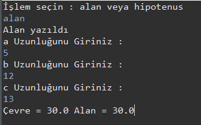
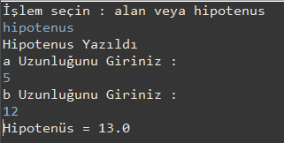

---

## [Taksimetre Hesaplayan Program](https://github.com/Berbet16/java101_practice_homeworks/blob/main/Taksimetre_Hesaplayan_Program.java)

- Java ile gidilen mesafeye (KM) göre taksimetre tutarını ekrana yazdıran programı yazın.

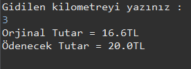
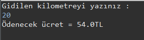

---

## [Dairenin Alanını ve Çevresini Bulan Program](https://github.com/Berbet16/java101_practice_homeworks/blob/main/Dairenin_Alan%C4%B1n%C4%B1_ve_%C3%87evresini_Bulan_Program.java)

- Java ile yarı çapını kullanıcıdan aldığınız dairenin alanını ve çevresini hesaplayan programı yazın.

Alan Formülü : π * r * r;

Çevre Formülü : 2 * π * r;

- Yarıçapı r, merkez açısısının ölçüsü 𝛼 olan daire diliminin alanı bulan programı yazınız.

𝜋 sayısını = 3.14 alınız.

Formül : (𝜋 * (r*r) * 𝛼) / 360

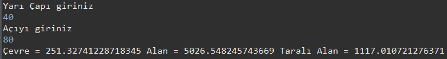

---

## [Vücut Kitle İndeksi Hesaplayan Program](https://github.com/Berbet16/java101_practice_homeworks/blob/main/V%C3%BCcut_Kitle_Indeksi_Hesaplayan_Program.java)

- Java ile kullanıcıdan boy ve kilo değerlerini alıp bir değişkene atayın. Aşağıda ki formüle göre kullanıcının "Vücut Kitle İndeks" değerini hesaplayıp ekrana yazdırın.

Formül
Kilo (kg) / Boy(m) * Boy(m)

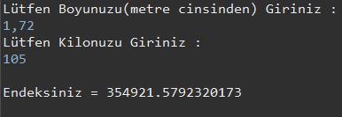

---

## [Manav Kasa Programı](https://github.com/Berbet16/java101_practice_homeworks/blob/main/Manav_Kasa.java)

- Java ile kullanıcıların manavdan almış oldukları ürünlerin kilogram değerlerine göre toplam tutarını ekrana yazdıran programı yazın.

- Meyveler ve KG Fiyatları

Armut : 2,14 TL  
Elma : 3,67 TL  
Domates : 1,11 TL  
Muz: 0,95 TL  
Patlıcan : 5,00 TL

---

## [Pratik Hesap Makinesi](https://github.com/Berbet16/java101_practice_homeworks/blob/main/Pratik_Hesap_Makinesi_Dersi.java)

- Java koşullu ifadeler ile basit hesap makinesi yapımı.

- Videodaki hesap makinesini switch-case kullanarak yapınız.

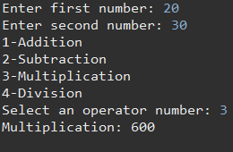
 
 ---
 
 ## [Kullanıcı Girişi Dersi](https://github.com/Berbet16/java101_practice_homeworks/blob/main/Pratik_Kullan%C4%B1c%C4%B1_Giri%C5%9Fi.java)
 
- Java koşullu ifadeler ile kullanıcı adı ve şifreyi kontrol eden program yapımı.

- Eğer şifre yanlış ise kullanıcıya şifresini sıfırlayıp sıfırlamayacağını sorun, eğer kullanıcı sıfırlamak isterse yeni girdiği şifrenin hatalı girdiği ve unuttuğu şifre ile aynı olmaması gerektiğini kontrol edip , şifreler aynı ise ekrana "Şifre oluşturulamadı, lütfen başka şifre giriniz." sorun yoksa "Şifre oluşturuldu" yazan programı yazınız.

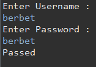
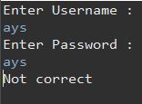

---

## [Hava Sıcaklığına Göre Etkinlik Önerme](https://github.com/Berbet16/java101_practice_homeworks/blob/main/Hava_S%C4%B1cakl%C4%B1%C4%9Fna_G%C3%B6re_Etkinlik_Onerme.java)

- Java koşullu ifadeler ile hava sıcaklığına göre etkinlik öneren program yapımı.

Koşullar :

- Sıcaklık 5'dan küçük ise "Kayak" yapmayı öner.
- Sıcaklık 5 ve 15 arasında ise "Sinema" etkinliğini öner.
- Sıcaklık 15 ve 25 arasında ise "Piknik" etkinliğini öner.
- Sıcaklık 25'ten büyük ise "Yüzme" etkinliğini öner.

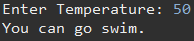

---

## [Sayıları Büyükten Küçüğe Sıralayan Program](https://github.com/Berbet16/java101_practice_homeworks/blob/main/Say%C4%B1lar%C4%B1_Buyukten_Kucuge_S%C4%B1ralama.java)

- Java koşullu ifadeler ile girilen 3 sayıyı büyükten küçüğe sıralayan program yapımı.

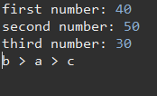

---

## [Burç Bulduran Program](https://github.com/Berbet16/java101_practice_homeworks/blob/main/Burc_Bulma_Program%C4%B1.java)

- Java koşullu ifadeler ile kullanıcının burcunu bulan program yapımı.

Koç Burcu : 21 Mart - 20 Nisan

Boğa Burcu : 21 Nisan - 21 Mayıs

İkizler Burcu : 22 Mayıs - 22 Haziran

Yengeç Burcu : 23 Haziran - 22 Temmuz

Aslan Burcu : 23 Temmuz - 22 Ağustos

Başak Burcu : 23 Ağustos - 22 Eylül

Terazi Burcu : 23 Eylül - 22 Ekim

Akrep Burcu : 23 Ekim - 21 Kasım

Yay Burcu : 22 Kasım - 21 Aralık

Oğlak Burcu : 22 Aralık - 21 Ocak

Kova Burcu : 22 Ocak - 19 Şubat

Balık Burcu : 20 Şubat - 20 Mart

- Aynı örneği switch-case kullanmadan yapınız.

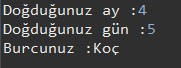
