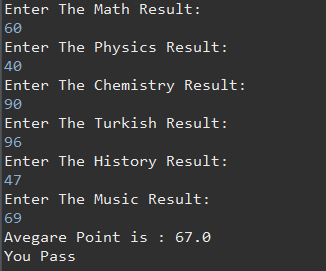
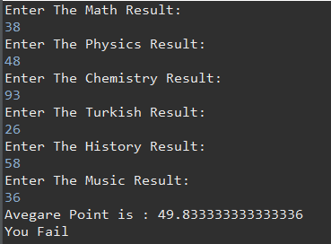
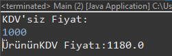
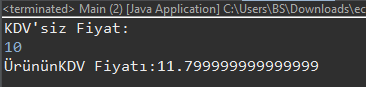
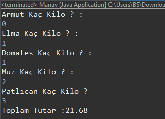

# Java 101 Homeworks

## [Not Ortalama Hesaplama Programı](https://github.com/Berbet16/java101_practice_homeworks/blob/main/not_ortalama_hesaplay%C4%B1c%C4%B1.java)

- Java ile Matematik, Fizik, Kimya, Türkçe, Tarih, Müzik derslerinin sınav puanlarını kullanıcıdan alan ve ortalamalarını hesaplayıp ekrana bastırılan programı yazın.

- Aynı program içerisinde koşullu ifadeler kullanılarak, eğer kullanıcının ortalaması 60'dan büyük ise ekrana "Sınıfı Geçti" , küçük ise "Sınıfta Kaldı" yazsın.

**(Not : If ve Else kullanılmayacak...)** 

## [KDV Tutarı Hesaplayan Program](https://github.com/Berbet16/java101_practice_homeworks/blob/main/KDV_Tutar%C4%B1_Hesaplayan_Program.java)
- Java ile kullanıcıdan alınan para değerinin KDV'li fiyatını ve KDV tutarını hesaplayıp ekrana bastıran programı yazın.

**(Not : KDV tutarını 18% olarak alın)**

KDV'siz Fiyat = 10;

KDV'li Fiyat = 11.8;

KDV tutarı = 1.8;

Eğer girilen tutar 0 ve 1000 TL arasında ise KDV oranı %18 , tutar 1000 TL'den büyük ise KDV oranını %8 olarak KDV tutarı hesaplayan programı yazınız.

## [Dik Üçgende Hipotenüs Bulan Program](https://github.com/Berbet16/java101_practice_homeworks/blob/main/Dik_U%C3%A7gende_Hipoten%C3%BCs_Bulan_Program.java)

## [Taksimetre Hesaplayan Program](https://github.com/Berbet16/java101_practice_homeworks/blob/main/Taksimetre_Hesaplayan_Program.java)

## [Dairenin Alanını ve Çevresini Bulan Program](https://github.com/Berbet16/java101_practice_homeworks/blob/main/Dairenin_Alan%C4%B1n%C4%B1_ve_%C3%87evresini_Bulan_Program.java)

## [Vücut Kitle İndeksi Hesaplayan Program](https://github.com/Berbet16/java101_practice_homeworks/blob/main/V%C3%BCcut_Kitle_Indeksi_Hesaplayan_Program.java)

## [Manav Kasa Programı](https://github.com/Berbet16/java101_practice_homeworks/blob/main/Manav_Kasa.java)

- Java ile kullanıcıların manavdan almış oldukları ürünlerin kilogram değerlerine göre toplam tutarını ekrana yazdıran programı yazın.

- Meyveler ve KG Fiyatları

Armut : 2,14 TL  
Elma : 3,67 TL  
Domates : 1,11 TL  
Muz: 0,95 TL  
Patlıcan : 5,00 TL

